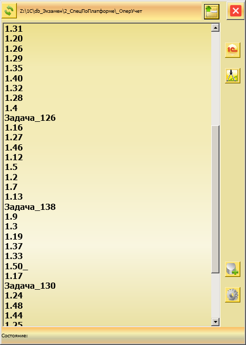

# QuickStart1C
Разворачиваем БД 1С в один клик

  Программа из разряда 1С:Стартеры, отличие в простоте.
  
  Также одно из отличий от других стартеров - можно развернуть хоть 1000 БД из dt или cf, кто занимается 1С в курсе.
  
  Тестировалась на Windows 7 x64 и Windows10x64
  
  Краткое описание:
  
  При первом запуске открывается окно настроек в котором можете указать где установлена 1С, если у Вас по умолчанию то путь найдеться сам и Вам надо просто закрыть окошко, сохранение при закрытии.  

  Основное окно программы, в котором можно выбрать каталог в котором находяться Ваши БД 1С,

  

  Например ~70 БД создаються за ~40 сек , 

  

  Теперь в списке можно выбрать БД и открыть либо в режиме Предприятия либо в режиме Конфигуратор

  Кнопки :

    - обновление текущего каталога 

    - выбор каталога, для просмотра БД 

    - настройки подключения 1С 

    - выбрать каталог в котором находяться dt и/или cf файлы - будут развернуты БД   

    -  режим запуска "Предприятие"

    -  режим запуска "Конфигуратор"
