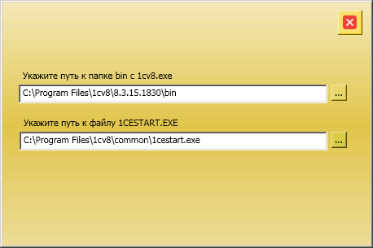
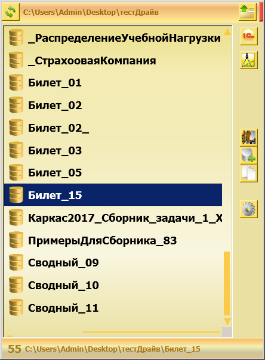

# QuickStart1C

  Проект C# WPF mvvm.
  Вернее будет сказать попытка MVVM, т.е. при разработке старался использовать рекомендации MVVM но некоторые моменты не реализовал с учетом MVVM, 
  такие как вторую форму, перемещение формы.

 

  Программа из разряда 1С:Стартеры, отличие в простоте.
  
  Также одно из отличий от других стартеров - можно развернуть хоть 1000 БД из dt или cf, одним кликом, кто занимается 1С в курсе.
  
  
    
  Краткое описание:
  
  При первом запуске открывается окно настроек в котором можете указать где установлена 1С, если у Вас по умолчанию то путь найдеться сам и Вам надо просто закрыть окошко, сохранение при закрытии.  

  Основное окно программы, в котором можно выбрать каталог в котором находяться Ваши БД 1С, автоматически создаеться файл список "имя_каталога.v8i",
  можно запустить в режиме Предприятие или в режиме Конфигуратора, любую из БД, также одним кликом можно клонировать выбранную БД.
  Также можно одним кликом создать пустую БД в текущем каталоге

  

 
 
  Теперь в списке можно выбрать БД и открыть либо в режиме Предприятия либо в режиме Конфигуратор

  Кнопки :

    - обновление текущего каталога 

    - выбор каталога, для просмотра БД 
  
    -  режим запуска "Предприятие"

    -  режим запуска "Конфигуратор"
  
    - открывает диалог выбора папки в которой сложены dt и/или cf

    - создает в текущем каталоге пустую БД  
  
    - создает в текущем каталоге пустую БД 
 
    - настройки подключения 1С 

  
   

  
  
   Тестировалась на Windows 7 x64 и Windows10x64
  Например ~70 БД создаються за ~40 сек , 
